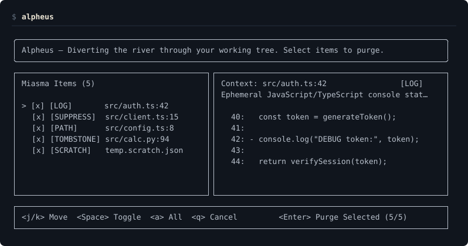
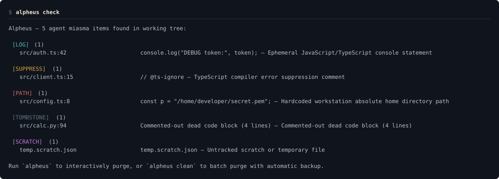
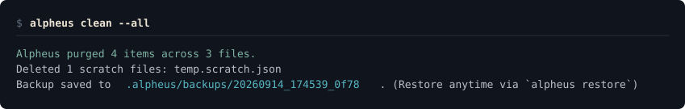

<div align="center">

# Alpheus

**A river through the stables.**
**Alpheus sweeps the agent's debris—debug prints, silenced linters, and scratch files—before you commit.**

[](https://github.com/AraneaDev/alpheus/releases)
[](https://aranea-development.nl/en/tools/alpheus)
[](./LICENSE)
[](https://github.com/AraneaDev/alpheus)
[](https://github.com/AraneaDev/alpheus/commits/main)
[](https://www.conventionalcommits.org/)
[](#status)
[](#development)

</div>

---



> **Alpheus** (Ἀλφειός) is the river god whose torrent Heracles diverted straight
> through the Augean stables, washing thirty years of accumulated dung into the
> sea in a single afternoon. This tool does the smaller, everyday version: it sweeps
> away the agent's debris—ephemeral debug logs, disabled linters, commented-out
> dead code, workstation paths, and untracked scratch files—before you commit.

Coding agents solve hard problems quickly, but they routinely leave pollution behind:
`console.log("token debug:", token)`, temporary test dumps (`temp.json`, `scratch.py`),
hardcoded workstation paths (`/home/tim/...`), and lazy linter-suppression comments
(`// @ts-ignore`, `/* eslint-disable */`, `# noqa`) inserted merely to silence compiler errors.

Git diff shows that code was added, but it cannot tell you which additions are intended
application logic and which are temporary scaffolding. Alpheus parses your working tree's
staged and unstaged diff additions, inspects untracked files against scratch heuristics, and
presents an interactive terminal interface to review and purge detritus with a single keystroke.

Every purge is backed by an atomic safety snapshot in `.alpheus/backups/`, allowing instant,
byte-for-byte restoration anytime.

<a id="status"></a>

> **Status:** pre-release. Alpheus is **not yet published to npm**, so it installs from this
> repository or from the Aranea marketplace: see [Install](#install). It requires
> [Bun](https://bun.sh/) 1.1 or newer and Git.

---

## Why it exists

When developers pair with autonomous coding agents, three distinct failure modes occur at commit time:

1. **Scaffolding Blindness:** An agent modifies 8 files to fix a bug, peppering prints and debugger
   breakpoints across callers to verify execution. The bug is fixed, the test suite passes, and the
   developer runs `git commit -am "fix bug"`—inadvertently shipping noisy debug output to production.
2. **Compiler Silencing:** Encountering a strict TypeScript or ESLint rule, an agent frequently slaps
   `// @ts-ignore` or `// eslint-disable-next-line` on the line above rather than resolving the type
   boundary. These suppressions degrade codebase type-safety over time.
3. **Workstation Leakage:** Agents routinely hardcode local machine absolute paths
   (`/home/alex/...`, `/Users/dev/workspace/...`, `C:\Users\...`) into config files, test harnesses,
   or scripts, causing immediate failures when run in CI or on a teammate's machine.

Alpheus acts as the final deterministic filter between agent execution and your git history.

---

## The Five Classes of Miasma

Every finding is categorized into one of five discrete classes:

| Class | Badge | What it detects | Supported Languages / Patterns |
| :--- | :--- | :--- | :--- |
| **Debug Logs** | `[LOG]` | Ephemeral console statements, print macros, and execution tracing | TypeScript/JS (`console.log/debug/dir`), Python (`print`, `breakpoint`, `pdb`), Rust (`dbg!`, `println!`), Go (`fmt.Print*`, `log.Print*`), PHP (`var_dump`, `dd`), Shell (`set -x`, `echo "DEBUG:..."`) |
| **Suppressions** | `[SUPPRESS]` | Compiler error, linter, and type checker suppression comments | `// @ts-ignore`, `@ts-expect-error`, `eslint-disable`, `biome-ignore`, `prettier-ignore`, Python `# noqa`, `# type: ignore`, Rust `#[allow(...)]`, Go `//nolint`, PHP `@phpstan-ignore` |
| **Scratch Files** | `[SCRATCH]` | Untracked temporary files, scratch scripts, and local dumps | `scratch.*`, `temp.*`, `tmp.*`, `*.dump`, `*.scratch`, `*.tmp`, `test_dump.*` |
| **Dead Code** | `[TOMBSTONE]` | Blocks of $\ge 3$ consecutive commented-out code lines | Multi-line commented syntax structures across TypeScript, Python, Rust, Go, PHP, and Shell |
| **Workstation Paths** | `[PATH]` | Hardcoded machine-specific absolute home directory paths | `/home/<user>/...`, `/Users/<user>/...`, `C:\Users\<user>\...` |

---

## Commands



```text
alpheus                      Launch interactive TUI to review & purge miasma
alpheus check [flags]        Non-interactive scan; exit 1 if miasma found (for CI/hooks)
alpheus clean --all [flags]  Batch purge all detected miasma with automatic backup
alpheus restore [id]         Restore working tree from backup snapshot (default: latest)
alpheus backups              List existing backup snapshots
alpheus help                 Show CLI usage and flag reference
```

### Flags

- `--json`: Output structured JSON array of findings (for `alpheus check`).
- `--quiet`: Suppress tabular output; return only the exit code (`0` for clean, `1` if miasma found).
- `--dry-run`: Simulate mutations without touching source files or creating backup archives.

---

## Interactive TUI

Run `alpheus` without arguments in your terminal to open the split-pane review interface:

- `<↑/↓>` or `<j/k>`: Navigate through the list of findings.
- `<Space>`: Toggle selection checkbox (`[x]` / `[ ]`) for individual items.
- `<a>`: Toggle selection of all detected items.
- `<Enter>`: Purge selected items in-place. Automatically creates an atomic backup before modifying files.
- `<q>` / `<Esc>`: Cancel and exit without modifying any files.

The right pane provides a live contextual diff preview, highlighting the exact line to be removed
surrounded by neighboring code.

---

## Safety & Rollback Protocol



Alpheus prioritizes codebase safety above all else:

1. **Automatic Backup Snapshot:** Prior to deleting any line or unlinking any scratch file, Alpheus
   creates a timestamped snapshot in `.alpheus/backups/<timestamp>_<hash>/` containing copies of all
   affected files and a cryptographic `manifest.json`.
2. **Git Exclude Protection:** Alpheus automatically appends `.alpheus/` to `.git/info/exclude`,
   ensuring backup snapshots never dirty your git status or get committed to your repository.
3. **Single-Command Revert:** Run `alpheus restore` at any time to revert the working tree to the
   exact byte-for-byte state prior to the most recent purge.
4. **Bottom-Up Mutation:** File modifications are applied bottom-up by line number, ensuring line
   coordinates never drift across multiple purges in the same file.

```bash
alpheus restore          # Restores to the state prior to the most recent purge
alpheus restore <id>     # Restores from a specific snapshot ID
alpheus backups          # Lists all historical snapshots with timestamps and file counts
```

---

## Claude Code Integration

Alpheus integrates into Claude Code as a native plugin:

1. **Pre-Tool-Use Hook:** Intercepts `git commit` commands before execution. If uncommitted agent
   miasma is detected in the working tree, Alpheus aborts the tool call and instructs the agent to
   clean the debris first.
2. **Slash Command:** Type `/alpheus` in Claude Code to inspect your working tree for miasma and
   receive a structured breakdown.

---

## What it does not do

- **Zero LLM Dependency:** Alpheus uses zero language models, zero tokens, and zero heuristic embeddings.
  All detection is 100% deterministic (unified diff AST slicing, comment classification, and regex matching).
- **Zero Telemetry:** Alpheus makes no network requests, transmits no analytics, and runs entirely local.
- **Does Not Modify Unstaged Files:** Alpheus only evaluates additions in the current `git diff` and
  untracked scratch files. Pre-existing clean repository code is never touched.
- **Never Commits Without Consent:** Alpheus sweeps your working tree clean; the decision to commit
  remains entirely yours.

---

## Installation

### From a release

```bash
bun install -g github:AraneaDev/alpheus
```

### From source

```bash
git clone https://github.com/AraneaDev/alpheus.git
cd alpheus
bun install
bun link
```

---

## Requirements

- [Bun](https://bun.sh/) 1.1.0 or newer
- Git 2.25 or newer

---

## Development

```bash
bun install
bun run check        # Runs lint, lint:docs, typecheck, knip, and test:coverage (>= 90% threshold)
bun run screenshots  # Re-generates SVG terminal screenshots in docs/images/
```

---

## License

MIT.

---

Built by [Aranea Development](https://aranea-development.nl).
